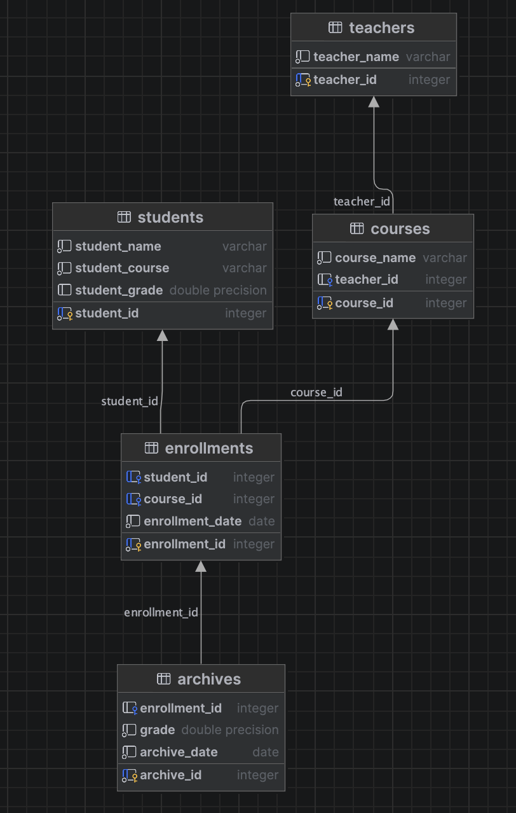
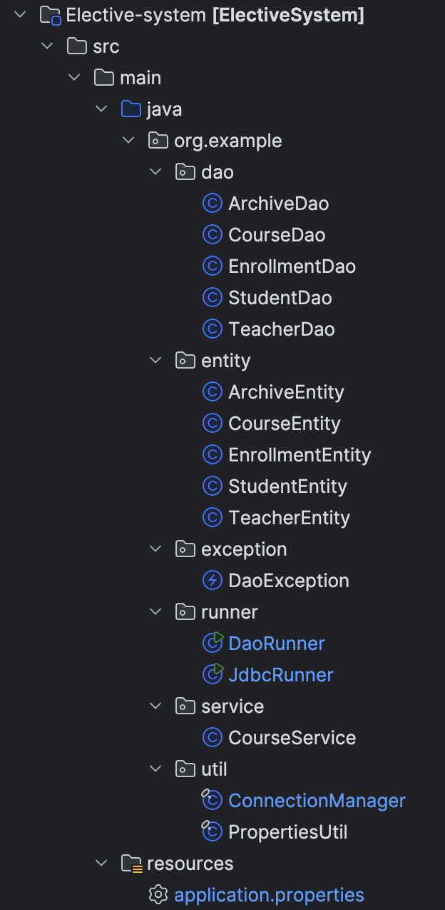

# Elective-system
## Overview
Elective-system is a Java-based web application for managing course enrollments. It allows instructors to create courses, students to enroll, and both to manage grades. The system uses PostgreSQL for data storage and relies on JDBC and DAO patterns for database interaction.

## Features
- Course creation and management by teachers.
- Student enrollment in courses.
- Grade management by teachers.
- Persistent data storage using PostgreSQL.

## Prerequisites
- Java Development Kit (JDK)
- PostgreSQL database
- Apache Maven
- IDE (e.g., IntelliJ IDEA, Eclipse)

## Database Setup
1. **Install PostgreSQL** and create a database named `elective`.
2. **Run the SQL script** to set up the database schema:
   ```bash
   psql -U yourUsername -d elective -a -f electiveBD.sql
   ```

<div style="float: right; width: 300px; height: 500px; margin-left: 20px;">
  
</div>

## Configuration
Edit the `application.properties` file to configure the database connection:
```properties
db.url=yourUrl
db.username=yourUsername
db.password=yourPassword
db.pool.size=5
```

## Project Structure
- **Entities**: Classes representing database tables (e.g., `CourseEntity`, `StudentEntity`).
- **DAOs**: Data Access Objects for database operations (e.g., `CourseDao`, `StudentDao`).
- **Services**: Business logic (e.g., enrollment, grading).
- **Runners**: Entry points to run the application (e.g., `JdbcRunner`, `DaoRunner`).
- **Util**: Utility classes for database connections (`ConnectionManager`).

<div style="float: right; width: 300px; height: 500px; margin-left: 20px;">
  
</div>


## Build and Run
1. **Navigate to the project directory**:
   ```bash
   cd Elective-system/Elective-system
   ```
2. **Build the project** using Maven:
   ```bash
   mvn clean install
   ```
3. **Run the application**:
   ```bash
   mvn exec:java -Dexec.mainClass="org.example.runner.JdbcRunner"
   ```
   Or for DAO implementation:
   ```bash
   mvn exec:java -Dexec.mainClass="org.example.runner.DaoRunner"
   ```

## Usage
- **Database**: Ensure PostgreSQL is running and the database is set up.
- **Access**: Navigate to the appropriate URL or interact via command line as configured.
- **Functionality**: Use the provided interfaces to manage courses, enrollments, and grades.

## Contributing
1. **Fork the repository**.
2. **Create a feature branch**: `git checkout -b feature-name`.
3. **Commit your changes**: `git commit -m 'Add some feature'`.
4. **Push to the branch**: `git push origin feature-name`.
5. **Open a pull request**.

## License
This project is licensed under the MIT License. See the LICENSE file for details.
